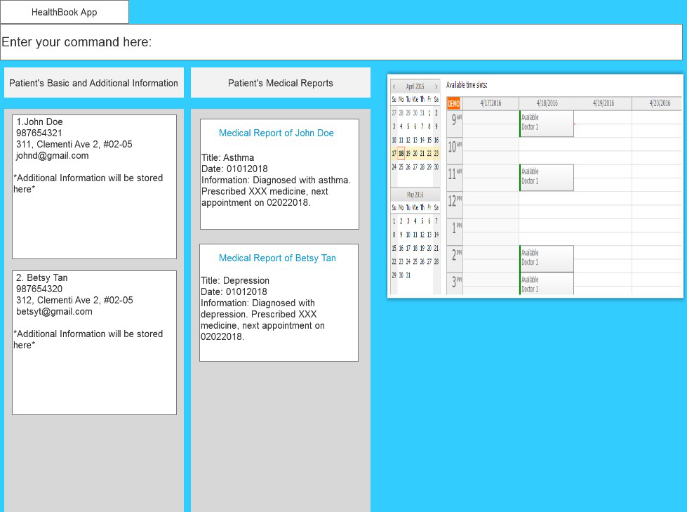

= Health Book

ifdef::env-github,env-browser[:relfileprefix: docs/]

https://travis-ci.org/CS2113-AY1819S1-T12-2/main[image:https://travis-ci.org/CS2113-AY1819S1-T12-2/main.svg?branch=master[Build Status]]
https://app.codacy.com/app/xhxh96/main?utm_source=github.com&utm_medium=referral&utm_content=CS2113-AY1819S1-T12-2/main&utm_campaign=Badge_Grade_Dashboard[image:https://api.codacy.com/project/badge/Grade/b3b9161e1b4a424aa5d1da1a6e759be6[Codacy Badge]]

ifdef::env-github[]

endif::[]

ifndef::env-github[]
image::images/MockUi.png[width="600"]
endif::[]

Health Book is a desktop address book application targeted at health care professionals who seek to retrieve their patients' personal details and health-related information all in one place.
The application provides both a Command Line Interface (CLI) for input of data and a Graphical User Interface (GUI) for displaying of output (patient's personal details and health-related information).
The application is fully written in Java, allowing cross-platform compatibility.

== Site Map

* <<UserGuide#, User Guide>>
* <<DeveloperGuide#, Developer Guide>>
* <<AboutUs#, About Us>>
* <<ContactUs#, Contact Us>>

== Acknowledgements

* This application is a fork of the original Address Book 4 application by https://github.com/se-edu/[SE-Edu Initiatives].
* Some parts of this sample application were inspired by the excellent http://code.makery.ch/library/javafx-8-tutorial/[Java FX tutorial] by
_Marco Jakob_.
* Libraries used: https://github.com/TestFX/TestFX[TextFX], https://bitbucket.org/controlsfx/controlsfx/[ControlsFX], https://github.com/FasterXML/jackson[Jackson], https://github.com/google/guava[Guava], https://github.com/junit-team/junit5[JUnit5]

== Licence : link:LICENSE[MIT]

