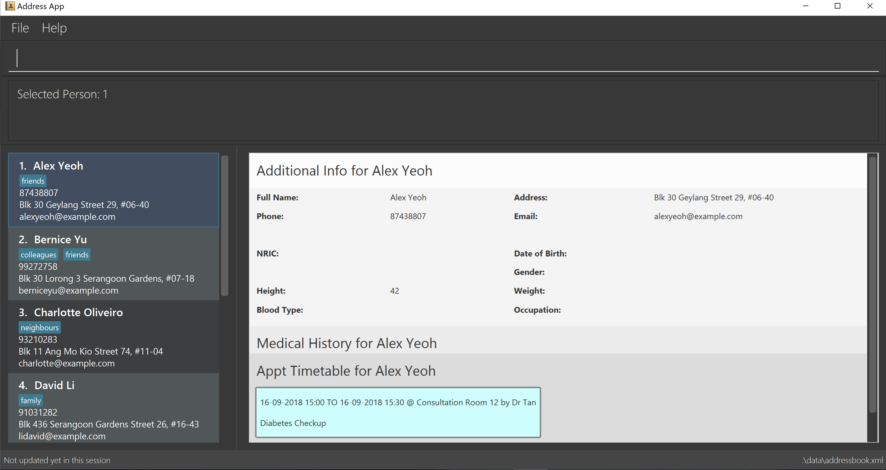

= Brandon Cheong - Project Portfolio
:site-section: AboutUs
:toc:
:sectnums:
:imagesDir: ../images
:stylesDir: ../stylesheets

This portfolio serves to document my technical and non-technical contributions for the Health Book project.

[discrete]
== Project: Health Book

---

== Overview

.User interface of Health Book

Health Book is an application that is catered for healthcare professionals who seek to store and retrieve their patients’ personal information and health-related information all in one place. A Command Line Interface (CLI) is utilized mainly for the input, while a Graphical User Interface (GUI) is used to display the output. By combining these 2 interfaces, Health Book aims to provide healthcare professionals with the speed and efficiency obtained from a CLI while retaining the systematic view of information through the GUI, thus easing the administrative burden on them and allowing them to focus on caring for their patients.

Health Book includes a variety of features to make administrative tasks easier for healthcare professionals. These include:

* an *additional information feature* to allow healthcare professionals to store and update patients' additional information like nric, blood type, height and weight for easy reference
* a *medical history feature* to allow healthcare professionals to store and update patients' medical history like allergies, previous country visited and discharge status
* an *appointments feature* to allow healthcare professionals to store and update patients' medical appointments to make it easy for them to track and schedule appointments for patients
* a *medical reports feature* to allow healthcare professionals to store and update patients' medical reports for easy reference, and to allow for detailed analysis of the patient's condition
* a *finding and sorting feature* to allow healthcare professionals to easily find patients by their personal and medical details

Health Book is primarily written in Java. CSS is used to design the GUI for improved user experience, and all data is stored in an XML format.

Our team developing Health Book comprised of a Project Manager, Development Lead, Quality Assurance Lead, Design Lead, and Subject Matter Expert for documentation and application workflow. For this project, I took up the role of Development Lead, and was in charge of setting the technical direction of the team.

== Summary of contributions

|===
|_This section documents my main contributions to the Health Book application. This showcases my ability to write functional and test code to enhance an application, manage a project and perform in a team setting._
|===

* *Major enhancement*: incorporated a feature to *add, view, edit and delete appointments for a patient*
** Justification: This feature improves the product significantly because the user can manage, schedule and track his patients' appointments easily and make sure that there are no scheduling clashes.
** Highlights: This enhancement affects existing commands and commands to be added in future. It required an in-depth analysis of design alternatives with regards to how the user would input appointment information. The implementation too was challenging due to the incorporation of multiple checks to prevent the user from entering wrong information like appointments which have timing clashes.
* *Minor enhancement*: added an *information panel for the displaying of patient information like medical histories and appointments* on the right side of the main app
** Justification: This feature improves the product significantly because the user can now see all the information for a selected patient in one window without having to navigate through multiple screens, thus making the application more user-friendly.
** Highlights: The implementation of this enhancement was challenging as auto-refreshing the information panel when the patient's information was updated was a difficult task. I eventually made use of the Java EventsCenter to raise an event when the patient's information was updated, thus alerting the user interface to refresh the information panel with the updated information.

* *Code contributed*: (https://nuscs2113-ay1819s1.github.io/dashboard/#=undefined&search=brandonccm1996[Code Dashboard])

* *Other contributions*:

** Project management:
*** As a Development Lead, I was in charge of:
**** Deciding overall features of Health Book application
**** Managing releases `v1.1` - `v1.4` (4 releases) on GitHub
**** Checking and merging all team pull requests for code changes and enhancements to ensure conformity to the finalised user stories
** Enhancements to existing features:
*** Designed cards for the displaying of patient appointments in the information panel using CSS
** Community:
*** PRs reviewed (with non-trivial review comments): (Pull requests https://github.com/CS2113-AY1819S1-T12-2/main/pull/97[#97], https://github.com/CS2113-AY1819S1-T12-2/main/pull/99[#99], https://github.com/CS2113-AY1819S1-T12-2/main/pull/106[#106])
*** Reported bugs and suggestions for other teams in the class, and provided technical suggestions for further improvement:  (Issues https://github.com/CS2113-AY1819S1-F09-1/main/issues/106[#106], https://github.com/CS2113-AY1819S1-F09-1/main/issues/108[#108], https://github.com/CS2113-AY1819S1-F09-1/main/issues/112[#112], https://github.com/CS2113-AY1819S1-F09-1/main/issues/116[#116])

== Contributions to the User Guide

|===
|_This section documents my contributions to the Health Book User Guide. This showcases my ability to write documentation targeting end-users._
|===

include::../UserGuide.adoc[tag=apptcommands]

== Contributions to the Developer Guide

|===
|_This section documents my contributions to the Health Book Developer Guide. This showcases my ability to write technical documentation and the technical depth of my contributions to the project._
|===

include::../DeveloperGuide.adoc[tag=addappt]

include::../DeveloperGuide.adoc[tag=apptusecases]
